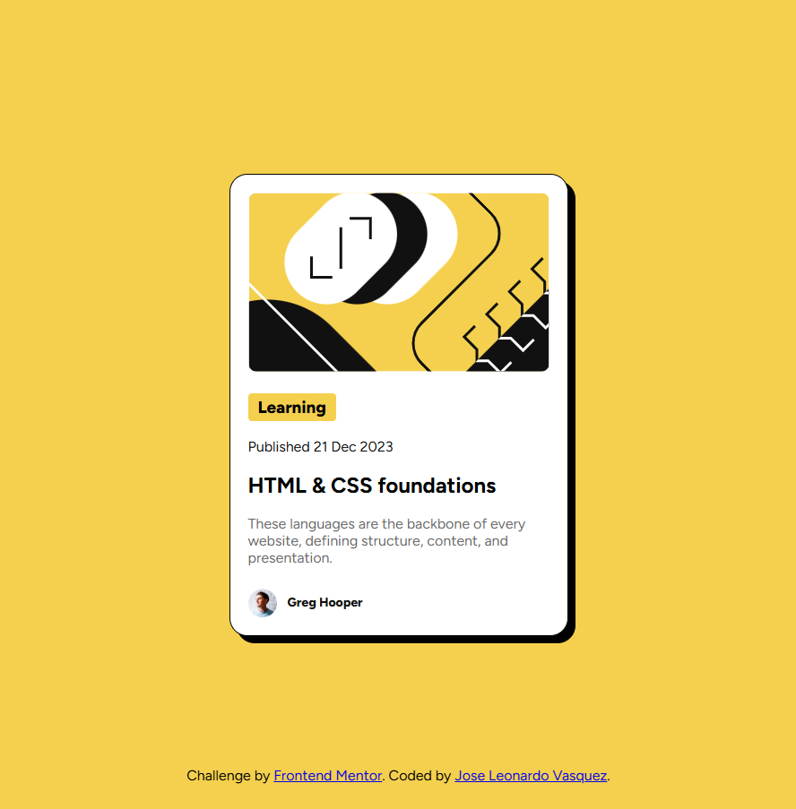

# Frontend Mentor - Blog preview card solution

This is a solution to the [Blog preview card challenge on Frontend Mentor](https://www.frontendmentor.io/challenges/blog-preview-card-ckPaj01IcS). Frontend Mentor challenges help you improve your coding skills by building realistic projects. 

## Table of contents

- [Overview](#overview)
  - [The challenge](#the-challenge)
  - [Screenshot](#screenshot)
  - [Links](#links)
- [My process](#my-process)
  - [Built with](#built-with)
  - [What I learned](#what-i-learned)
  - [Continued development](#continued-development)
  - [Useful resources](#useful-resources)
- [Author](#author)


## Overview

### The challenge

Users should be able to:

- See hover and focus states for all interactive elements on the page

### Screenshot




### Links

- Solution URL: [Add solution URL here](https://github.com/JoseLeoV77/qr-component)
- Live Site URL: [Add live site URL here](https://joseleov77.github.io/qr-component/)

## My process

### Built with

- Semantic HTML5 markup
- CSS custom properties
- Flexbox
- Mobile-first workflow

### What I learned

I learned how to use the time element

```html
<time datetime="2023-12-21">Published 21 Dec 2023</time>
```

### Continued development

I'm still not fully comfortable with CSS.

### Useful resources

- [figma](https://www.figma.com/) - This helped me to see in detail the project's design


## Author

- Frontend Mentor - [@JoseLeoV77](https://www.frontendmentor.io/profile/JoseLeoV77)


